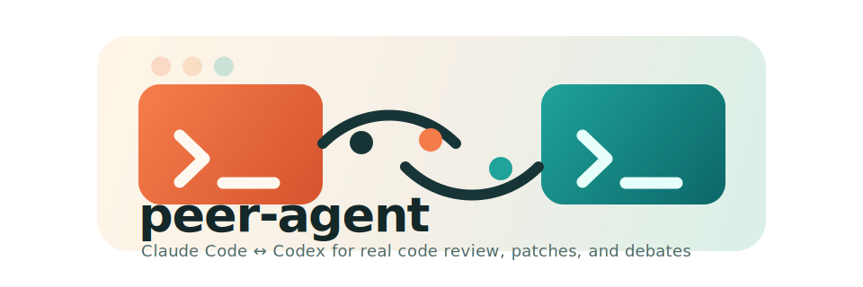

<p align="center">
  
</p>

# peer-agent

`peer-agent` is a small bridge between Codex and Claude Code. After installation, you can ask one agent to review, patch, edit, or debate a file from inside the other.

The primary interface is natural language inside Codex and Claude Code. `peer-agent` installs the helper commands and skill files that make that possible.

## Quick start

```bash
git clone https://github.com/renlon/peer-agent.git
cd peer-agent
./install.sh
peer-agent-doctor
```

Then open Codex or Claude Code in your project and ask for help in plain language, for example:

- "Ask Claude to review `src/auth.ts` and focus on correctness."
- "Have Codex edit `src/server.ts` to make the smallest safe fix."
- "Debate `src/retry.py` with Claude and include a judge."

## What gets installed

`./install.sh` copies the project into `${PEER_AGENT_HOME:-~/.local/share/peer-agent}`, symlinks commands into `${PEER_AGENT_BIN_DIR:-~/.local/bin}`, and installs personal skills for:

- Codex: `~/.codex/skills/peer-agent/SKILL.md`
- Claude Code: `~/.claude/skills/peer-agent/SKILL.md`

Installed commands:

- `ask-claude`: asks Claude Code to `review`, `patch`, or `edit` one target file
- `ask-codex`: asks Codex to `review`, `patch`, or `edit` one target file
- `peer-debate`: runs a structured back-and-forth debate between Claude Code and Codex about one target file, with an optional judge pass
- `peer-agent-doctor`: checks that the helpers, required CLI flags, and installed skills are available

These commands are the backend helpers. In normal use, the installed skills call them for you.

## Prerequisites

- Python 3
- `claude` on `PATH` and authenticated
- `codex` on `PATH` and authenticated

`peer-agent` does not install, log in to, or manage credentials for Claude Code, Codex CLI, or any project-specific toolchain.

Validated locally:

- Claude Code 2.1.81
- Codex CLI 0.116.0

More detail:

- [Installation Guide](docs/installation.md)
- [Usage Guide](docs/usage.md)
- [User Guide](docs/user-guide.md)

## Real example

You are in Codex debugging a billing retry bug. A failed webhook can be replayed, and you want a second opinion before you touch production code.

In Codex:

1. Ask for a focused review:
   "Ask Claude to review `src/billing/webhook_handler.ts` for duplicate-charge risk, idempotency gaps, and missing tests."
2. If the review finds a likely bug, ask for a patch:
   "Have Claude propose the smallest safe patch for `src/billing/webhook_handler.ts`."
3. If the tradeoff is still unclear, get both agents involved:
   "Debate `src/billing/webhook_handler.ts` with Claude and include a judge. Focus on whether the retry path can double-credit the account."

You can use the same workflow in Claude Code:

- "Ask Codex to review `src/billing/webhook_handler.ts` for duplicate-charge risk and missing tests."
- "Have Codex edit `src/billing/webhook_handler.ts` to make the smallest safe fix."
- "Debate this file with Codex and include a judge."

The installed skills translate those requests into the helper commands automatically. You usually do not need to run the scripts directly unless you are debugging or automating.

## Platform Notes

The current installer is a POSIX shell script. In practice, that means:

- it is intended for Unix-like environments
- it is not Bash-specific and does not require Zsh specifically
- it should work in `sh`-compatible shells on macOS and Linux
- it is not a native Windows installer

## Current limitations

- Single-file snapshotting is the core abstraction today.
- No shared session memory yet.
- No direct MCP transport between tools.
- No official Windows installer yet.
- Debate quality still depends on how much extra context each CLI decides to read.
